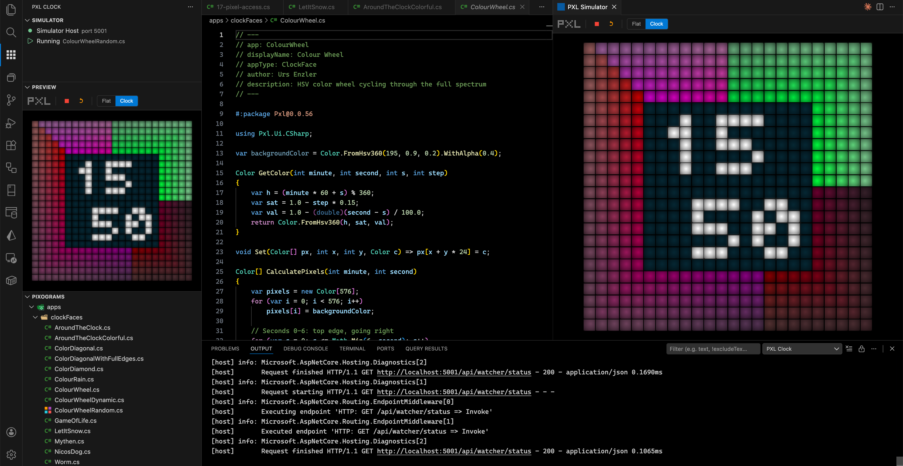

# PXL Clock Simulator for VS Code

Develop, preview and run pixograms for the [PXL Clock](https://www.pxlclock.com) directly in VS Code.



## What is the PXL Clock?

The PXL Clock is a programmable 24x24 RGB pixel display in a handcrafted frame with real glass. What makes it unique: you program it in **C#** using the [Pxl NuGet package](https://www.nuget.org/packages/Pxl).


## Features

- **Built-in Simulator** — runs your pixograms locally, no device needed
- **Live Preview** — see your pixel art directly in the VS Code sidebar or as a separate panel
- **Run & Stop** — launch `.cs` pixogram scripts with one click from the editor toolbar or file tree
- **File Explorer** — browse clock faces, demos and your own pixograms
- **Hot Reload** — edit a running script and see changes instantly
- **Flat & Clock rendering modes** — switch between flat pixel view and realistic LED look

## Getting Started

1. Install the extension
2. Open a folder containing `.cs` pixogram files (e.g. clone [pxl-clock](https://github.com/SchlenkR/pxl-clock))
3. The simulator starts automatically in the background
4. Click a `.cs` file in the **Pixograms** panel and hit the play button
5. Watch the preview in the **Preview** sidebar panel, or open a full-size simulator with `PXL Clock: Open Simulator`

## Commands

| Command | Description |
|---------|-------------|
| `PXL Clock: Open Simulator` | Open the simulator as a full editor panel |
| `PXL Clock: Run Current Script` | Run the active `.cs` file |
| `PXL Clock: Stop Script` | Stop the running pixogram |
| `PXL Clock: Restart Script` | Restart the running pixogram |
| `PXL Clock: Start Simulator` | Manually start the simulator host |
| `PXL Clock: Stop Simulator` | Stop the simulator host |
| `PXL Clock: Show Log` | Show the output log |

## Configuration

| Setting | Default | Description |
|---------|---------|-------------|
| `pxl.simulatorHost` | `http://localhost:5001` | URL of the PXL Simulator Host |

## Writing Pixograms

Pixograms are C# scripts using the Pxl API. Here's a minimal example:

```csharp
#: package Pxl 0.0.56

using Pxl.Ui.CSharp;

Color GetColor(int minute, int second, int x, int y, int step)
{
    var hue = (x + y + step) * 5.0 / 360.0;
    return Color.FromHSV(hue, 1.0, 1.0);
}
```

For more examples, check out the [pxl-clock repository](https://github.com/SchlenkR/pxl-clock).

## Links

- [PXL Clock Website](https://www.pxlclock.com)
- [GitHub](https://github.com/SchlenkR/pxl-clock)
- [Discord Community](https://discord.gg/KDbVdKQh5j)
- [NuGet Package](https://www.nuget.org/packages/Pxl)
